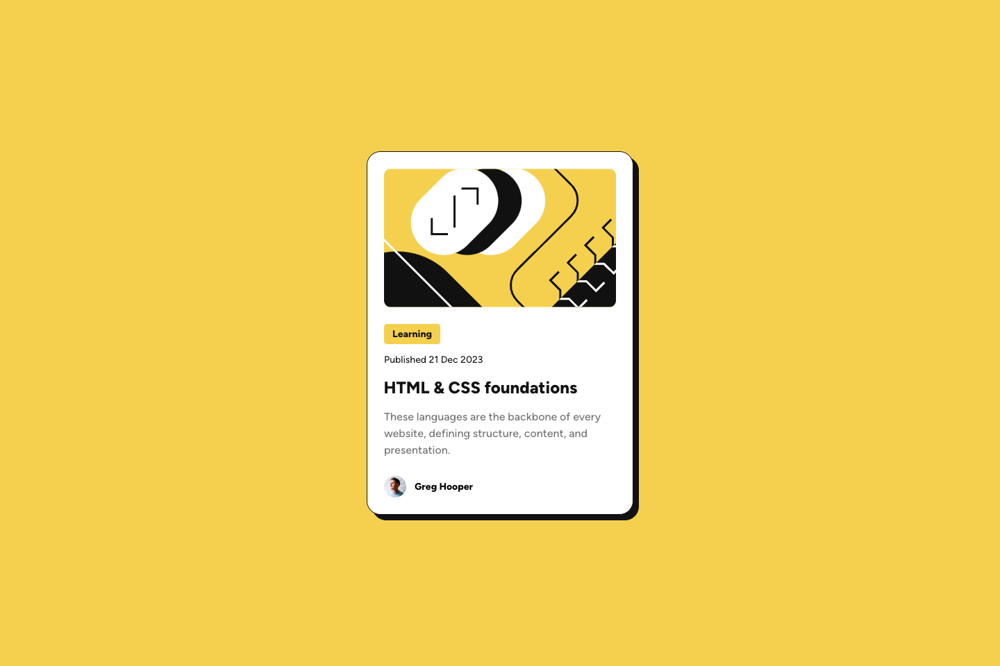

# Frontend Mentor - Blog preview card solution

This is a solution to the [Blog preview card challenge on Frontend Mentor](https://www.frontendmentor.io/challenges/blog-preview-card-ckPaj01IcS).
Frontend Mentor challenges help you improve your coding skills by building realistic projects.

## Table of contents

- [Overview](#overview)
  - [The challenge](#the-challenge)
  - [Screenshot](#screenshot)
  - [Links](#links)
- [My process](#my-process)
  - [Built with](#built-with)
  - [What I learned](#what-i-learned)
  - [Useful resources](#useful-resources)
- [Author](#author)

## Overview

### The challenge

Users should be able to:

- View the optimal layout depending on their device's screen size
- See hover and focus states for all interactive elements on the page

### Screenshot



### Links

- Solution URL: [https://github.com/alkersan/blog-preview-card](https://github.com/alkersan/blog-preview-card)
- Live Site URL: [https://alkersan.github.io/blog-preview-card/](https://alkersan.github.io/blog-preview-card/)

## My process

### Built with

- Fluid layout
- CSS Animations
- [React](https://react.dev) - JS library
- [Styled Components](https://styled-components.com/) - For CSS
- [Vite](https://vitejs.dev) - Build tool

### What I learned
In this exercise, I used fluid fonts and margins, instead of media queries.
For example, to accommodate very small viewports, I want the margins to gradually disappear
and the font size to shrink:
```js
const Wrapper = styled.article`
  // From 0 to 24px on screens below 375px
  margin-inline: clamp(0rem, -7.5rem + 37.5vw, 1.5rem);
`;

const Title = styled.h1`
  // Grow from 20 to 24px on vewports between 375 to 450px */
  font-size: clamp(1.25rem, 0rem + 5.333vw, 1.5rem);
`;
```

Another new thing was the animation. I didn't want the shadow to disappear instantly in the active state
but to subtly move under the card. It was pretty simple to achieve with the `transition` of the `filter` property.
```js
const Wrapper = styled.article`
  --shadow-offset: 8px;
  filter: drop-shadow(var(--shadow-offset) var(--shadow-offset) 0 var(--color-black));
  transition: filter 200ms;
  
  &:hover {
    --shadow-offset: 0;
  }
`;
```

### Useful resources
 - The course [css-for-js](https://css-for-js.dev) helped me immensely.
 - [clamp() calculator](https://chrisburnell.com/clamp-calculator/)   

## Author

- Frontend Mentor - [@alkersan](https://www.frontendmentor.io/profile/alkersan)
